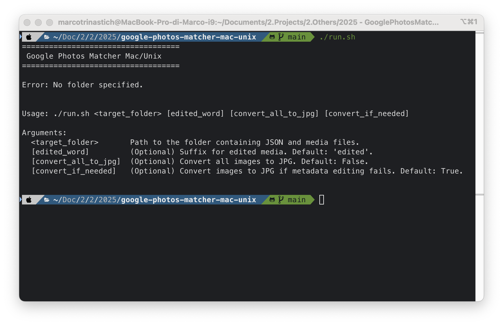
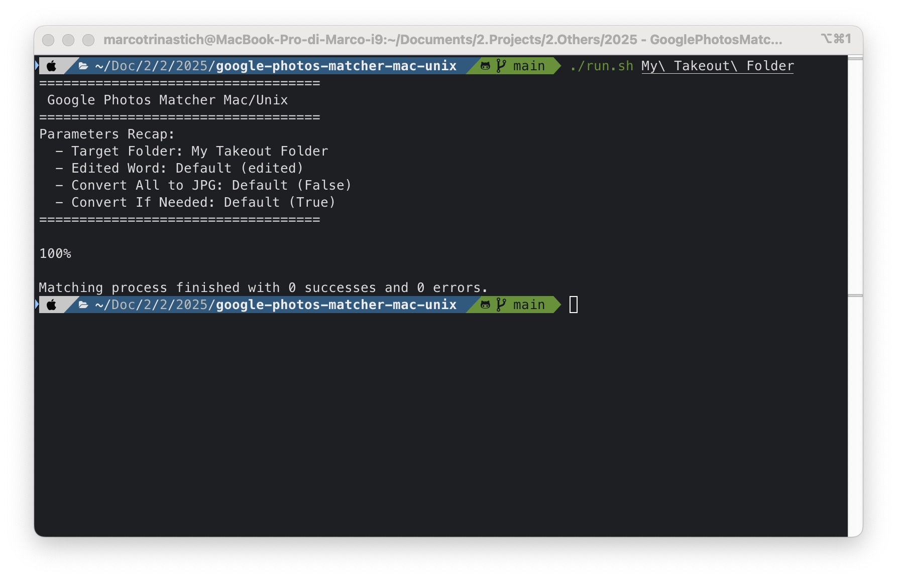
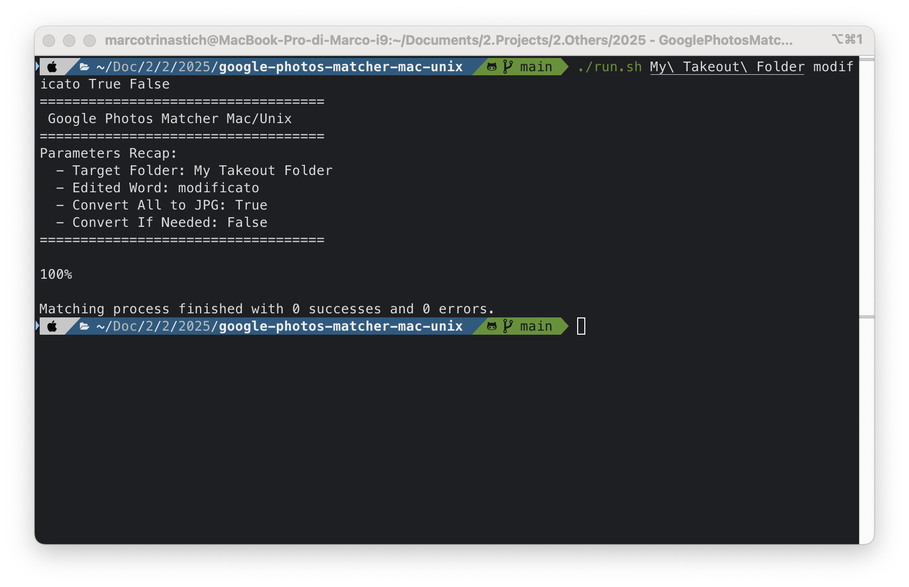

# Google Photos Matcher Mac/Unix

A free and open-source tool to restore lost metadata (e.g., dates, GPS coordinates) to images and videos downloaded from Google Photos Takeout, optimized for Mac and Unix systems.

Designed as a cost-free alternative to [MetadataFixer](https://metadatafixer.com/pricing), this tool ensures your media files retain their original metadata effortlessly.

## Table of Contents

1. [Project Overview](#project-overview)
2. [Features](#features)
3. [Screenshots](#screenshots)
4. [Usage](#usage)
   - [Setup](#setup)
   - [How to Run](#how-to-run)
   - [Parameters](#parameters)
5. [FAQs](#faqs)
   - [Why is there another folder called _EditedRaw_?](#why-is-there-another-folder-called-editedraw)
   - [Why do some images/videos stay unmatched?](#why-do-some-imagesvideos-stay-unmatched)
6. [Extras](#extras)
   - [Debugging](#debugging)
   - [Bonus Tools](#bonus-tools)
7. [Acknowledgments](#acknowledgments)
8. [Support](#support)
9. [License](#license)

## Project Overview

When you download images and videos from Google Photos Takeout, they lose important metadata, such as the date and the GPS coordinates where they were taken. This tool restores that information by matching it from the downloaded JSON files, ensuring your media files retain their original context.

This project is a fork of [GooglePhotosMatcher](https://github.com/anderbggo/GooglePhotosMatcher), enhanced for seamless compatibility with Mac and Unix systems.

## Features

- **Metadata Matching:** Matches metadata (date, GPS coordinates) from JSON files to images/live photos/videos.
- **Edited/Original Support:** Supports edited and original versions of media files.
- **Cross-Platform:** Compatible with Mac and Unix systems.
- **Free & Open-Source:** Completely free and open-source.

## Screenshots

Here are some screenshots showcasing the application in action:

1. **App Usage**  
   

2. **Metadata Matching**  
   

3. **Metadata Matching with Custom Params**  
   

## Usage

### Setup

1. **Download your Google Photos media**  
   Use [Google Takeout](https://takeout.google.com/) to download your photos and JSON metadata.

2. **Clone this repository**  
   Run the following command to download the source code:

   ```bash
   git clone https://github.com/mtmarco87/google-photos-matcher-mac-unix.git
   ```

3. **Install Python 3**
   Install Python 3 on your system:

   - On macOS:

     ```bash
     brew install python3
     ```

   - On Linux:

     ```bash
     sudo apt-get install python3
     ```

4. **Install ExifTool**  
   Install ExifTool for metadata manipulation:

   - On macOS:

     ```bash
     brew install exiftool
     ```

   - On Linux:

     ```bash
     sudo apt-get install exiftool
     ```

5. **Install Python dependencies**  
   From the project folder, run:

   ```bash
   pip install -r requirements.txt
   ```

6. **Make the script executable**  
   Grant execution permissions to the `run.sh` script:

   ```bash
   chmod +x run.sh
   ```

### How to Run

To match and fix your Google Photos metadata, execute the `run.sh` script from the project folder, targeting any Takeout folder containing JSON and media files.

#### Example:

```bash
./run.sh Takeout/Google\ Photos/Photos\ from\ 2025
```

Matched images/videos will be on directory _Matched_ inside the same path.

### Parameters

The script supports the following parameters:

1. **`target_folder`**  
   The path to the folder containing JSON and media files to process.

2. **`edited_prefix`** _(optional)_  
   Specifies the suffix Google uses for edited images in your local language.

   - Default: `edited`
   - Example values: `modificato` (IT), `editado` (ES).

3. **`convert_all_to_jpg`** _(optional)_  
   Whether to convert all EXIF-compatible image files (TIF, TIFF, JPEG, JPG) to JPG.

   - Default: `false`
   - Possible values: `true`, `false`.

4. **`convert_if_needed`** _(optional)_  
   Whether to convert EXIF-compatible images to JPG if metadata editing fails.
   - Default: `true`
   - Possible values: `true`, `false`.

#### Full Command Example:

```bash
./run.sh target_folder edited_prefix convert_all_to_jpg convert_if_needed
```

## FAQs

### Why is there another folder called _EditedRaw_?

Google Photos stores two versions of edited media:

1. The **edited version** (stored in the `Matched` folder).
2. The **original version** (stored in the `EditedRaw` folder).

### Why do some images/videos stay unmatched?

Some files may remain unmatched due to special characters in their names. To fix this:

1. Rename the file and its corresponding JSON to remove special characters.  
   Example: Rename `%E&xample.jpg` to `Example.jpg` and `%E&xample.json` to `Example.json`.

2. Open the JSON file and update the `title` attribute to match the new file name.

3. Run the script again.

## Extras

### Debugging

If you encounter issues during the matching process, you can debug the application by redirecting the output to a file for analysis:

```bash
./run.sh Takeout/Google\ Photos/Photos\ from\ 2025 > results.txt
```

#### Steps to Debug:

1. **Review the `results.txt` file**  
   Open the file in any text editor to check the output.

2. **Check for Successes and Errors**

   - **Success:** Look for `0 errors` at the bottom of the file. The number of successes should match the number of media files in your Takeout folder.
   - **Errors:** Search for lines containing `Error` for details about any issues.

3. **Analyze Logs**  
   The application provides detailed logs for each file:
   - **Image Exif updated:** Creation date metadata was successfully added or updated.
   - **Image GPS Data added/updated:** GPS data (latitude, longitude, altitude) was successfully added or updated.
   - **Warning: Image coordinates not settled:** Indicates an issue with GPS data for an image.
   - **Video Exif updated:** Creation date and GPS data were successfully added or updated for a video file (applied to `Apple`- or `Android`-specific tags).
   - **Warning: Video coordinates not settled:** Indicates an issue with GPS data for a video.
   - **Warning: Fixed Exif:** Non-standard EXIF tags were corrected (e.g., `37121`, `37500`, `41728`, `41729`).

### Bonus Tools

Additional tools are available in the `tools` folder:

1. **`convert-vp9-to-mp4.sh`**  
   This script converts VP9-encoded videos (unsupported by some devices, such as Apple devices, but used automatically by Google sometimes) to H.264 MP4 format while preserving **file creation/modification dates** and **GPS coordinates**. This ensures that metadata integrity is maintained during the conversion process.

   - **Prerequisites:**

     ```bash
     brew install ffmpeg
     chmod +x ./tools/convert-vp9-to-mp4.sh
     ```

   - **Usage:**

     ```bash
     ./tools/convert-vp9-to-mp4.sh source_video_file converted_video_file
     ```

   - **Features:**
     - Transcodes VP9 videos to H.264 MP4 format.
     - Copies over all metadata, including GPS coordinates.
     - Reapplies correct file creation and modification dates.

2. **`terabox-folder-compare.js` and `filecount.py`**  
   These tools help verify that all your Google Photos Takeout files have been uploaded to Terabox (since it does not provide a way to count files in a folder):

   - **`filecount.py`**: Recursively counts files and folders in a local directory and outputs the structure in JSON format.

     - **Usage:**
       ```bash
       python filecount.py target_folder
       ```

   - **`terabox-folder-compare.js`**: Compares the local folder structure (from `filecount.py`) with the file counts in Terabox by interacting with its web app APIs.
     - **Usage:**  
       Paste the script into your browser's developer tools console while logged into Terabox and follow the instructions in the script.

   These tools ensure that your uploaded files match the original folder structure.

3. **`terabox-file-counter-fetch.js`**  
   This script counts the number of files in a Terabox folder, helping verify that all your Google Photos Takeout files have been uploaded correctly. It works by interacting with the Terabox web app's internal APIs.

   - **Usage:**  
      Paste the script into your browser's developer tools console while logged into Terabox and follow the instructions in the script.

   - **Notes:**
     - The script may need adjustments if Terabox updates its APIs.
     - An XHR-based variant is included for older browser compatibility.

## Acknowledgments

- **[mtmarco87](mailto:mt.marco87@gmail.com)** - Author of this project.
- **anderbggo** - Author of the original Google Photos Matcher.
- **Freepik** - Icon creator.

## Support

If you find this project useful, consider supporting its development:

- ⭐ Star the repository to show your appreciation.
- 💬 Share feedback or suggestions by opening an issue.
- ☕ [Buy me a coffee](https://buymeacoffee.com/mtmarco87) to support future updates and improvements.
- 🔵 BTC Address: `bc1qzy6e99pkeq00rsx8jptx93jv56s9ak2lz32e2d`
- 🟣 ETH Address: `0x38cf74ED056fF994342941372F8ffC5C45E6cF21`

## License

This project is licensed under the [GNU General Public License v3.0](LICENSE). See the `LICENSE` file for details.
